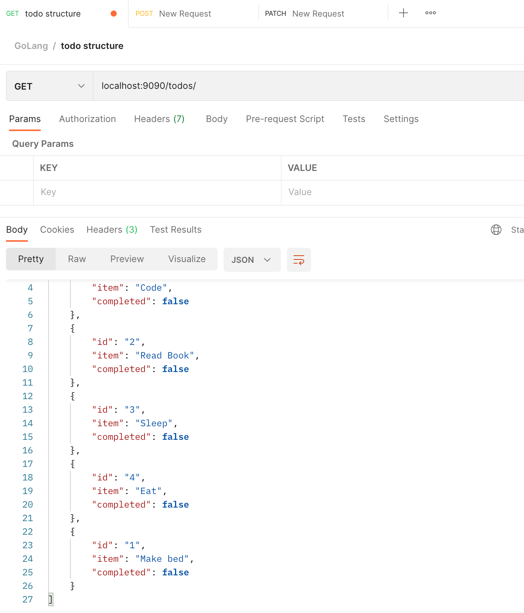
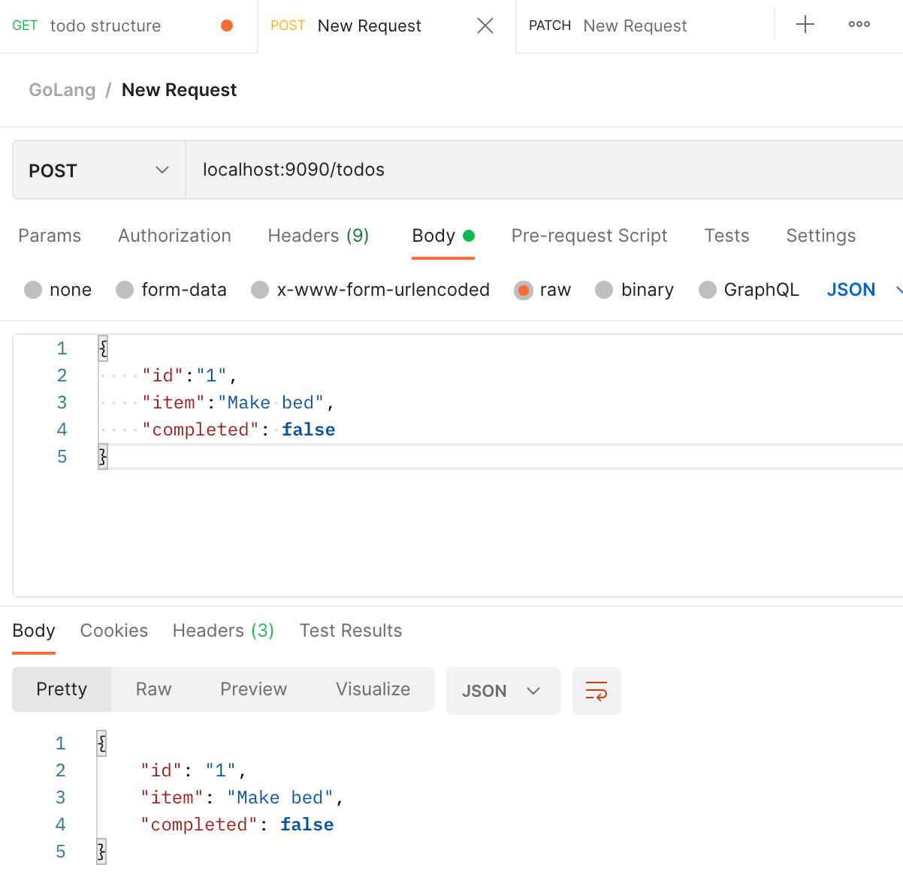
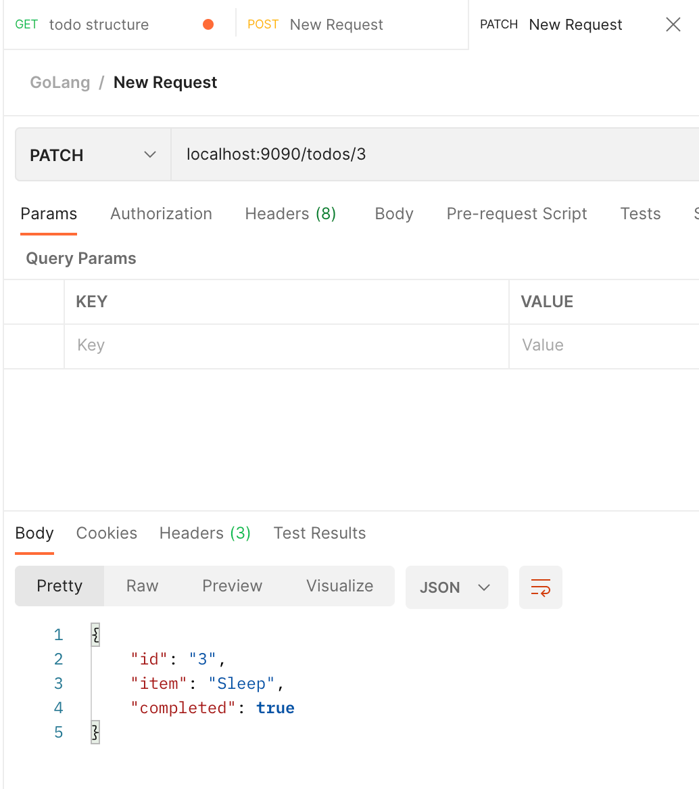
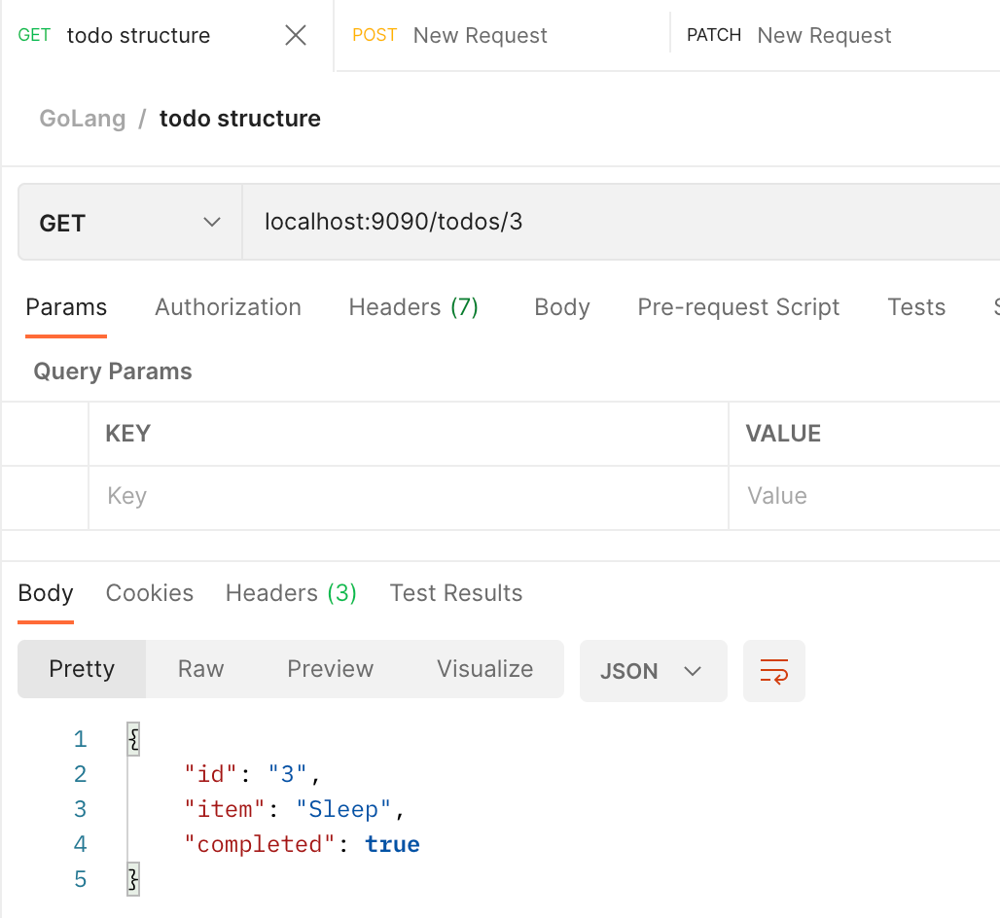

## API Endpoints

These screenshots were taken from POSTMAN

GET /tasks: Retrieve all tasks.

POST /tasks: Create a new task.

PATCH /tasks/{id}: Update an existing task by ID.

GET /tasks/{id}: Retrieve a specific task by ID.

